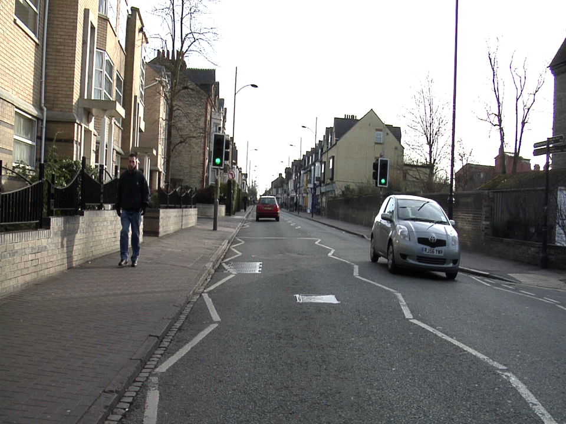
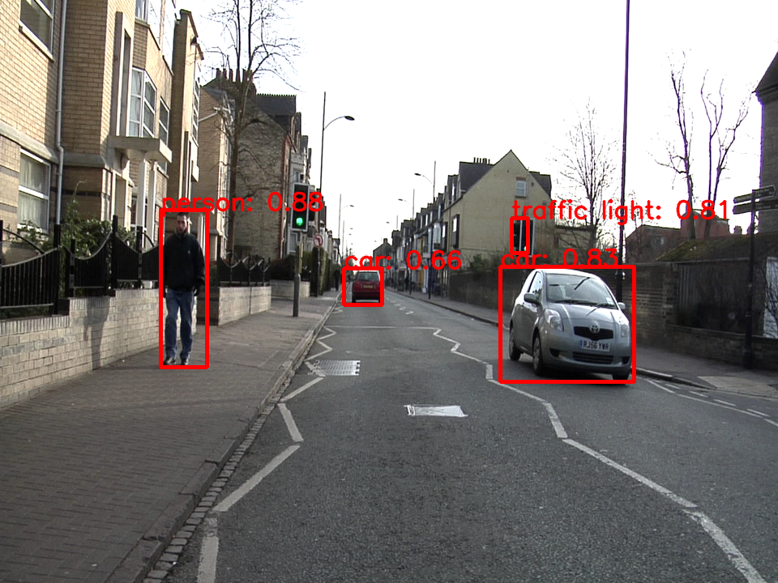
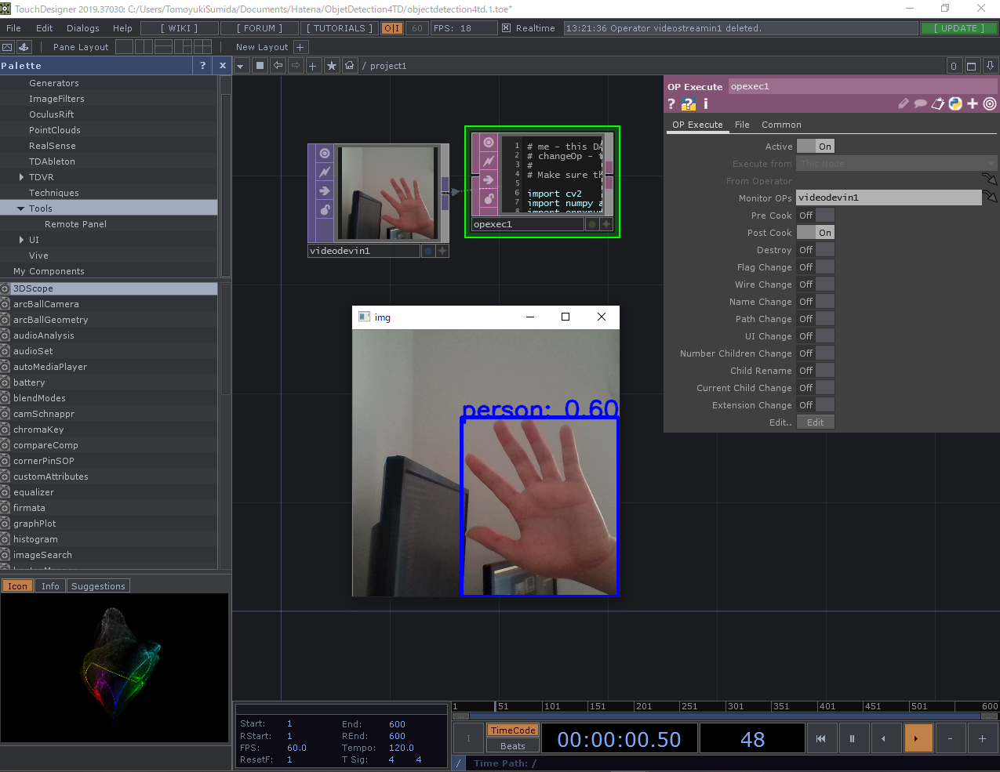

# ObjectDetection4TouchDesginer

Example of running object detection on TouchDesigner.

# Overview

Using ONNX on TouchDesigner to run object detection.
In addition, a sample program for inference using ONNX is provided.

# Environment
 - Windows10 home 64bit
 - TouchDesigner
 - Anaconda

```
$conda create -n {env_name} python=3.7.2
$activate {env_name}
$pip install -r requirements.txt
```

# Usage

## Usage Sample Script

The inference result of pic/demo.png is output as pic/result.png.

```
$python test_onnx.py
```

| | |
| :---: | :---: |
| pic/demo.png | pic/result.png |

## Usage TouchDesigner
#### 1. Set Library Path
TouchDesigner > Preferences

Check the [Add External Python to Search Path] and Enter the path of [Python 64-bit Module Path]

For Example
```
C:/Users/{User name}/Anaconda3/envs/{env name}/Lib/site-packages
```

#### 2. Edit opexec1
Modify the model path of the code in [opexec1] as appropriate.


#### 3. Get Start
Change the Post Cook of [opexec1] from Off to On.



# License
Copyright © 2020 T_Sumida Distributed under the MIT License.
